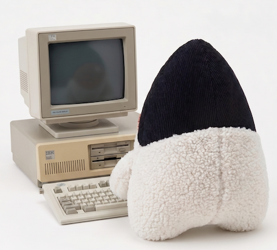

[](https://jitpack.io/#umjammer/vavi-apps-dosbox)
[](https://github.com/umjammer/vavi-apps-dosbox/actions/workflows/gradle.yml)
[](https://github.com/umjammer/vavi-apps-dosbox/actions/workflows/codeql.yml)


# vavi-apps-dosbox



🕹️ Java x86 emulator based on [jDOSBox](https://github.com/Tennessene/jDOSBox), with a capability running .exe w/ win32 dll 

## Install

 * [gradle](https://jitpack.io/#umjammer/vavi-apps-dosbox)

## Usage

* `MMFTOOLC.EXE` uses `M5_EmuSmw5.dll` that uses win32 api

```shell
$ java -jar /Users/nsano/src/java/jDOSBox/launcher/build/libs/launcher-0.74.31.jar \
  -c 'mount c /usr/local' \
  -c 'c:' \
  -c 'cd MMFTOOL' \
  -c 'MMFTOOLC.EXE TEST.MMF'
```

### embedding

`jdos.api.JDosBox` runs a machine from inside another program. Two of its outputs can be taken
rather than left to the host: `waveOutSink` for what a win32 guest writes to its `waveOut` device
(`AudioSink`, whose `write` blocking is also what paces a `turbo` machine), and `stdioSink` for
what the guest writes to its own `stdout` and `stderr` (`StdioSink` - jdosbox's own diagnostics
are not included).

Each chunk of guest output is stamped with the audio the guest had produced when it wrote it, in
frames of the `AudioSink` stream. That is what lets a host line up what a guest says with the
sound it is saying it about: a machine used as an audio source runs seconds ahead of what is
being heard, so the text is that far ahead of the sound without it.

```java
JDosBox dosbox = new JDosBox()
        .mount('c', dir)
        .command("c:")
        .command("player.exe song.dat")
        .waveOutSink(mySink)
        .stdioSink((data, offset, length, frames) -> ...)
        .turbo(true)
        .exitWhenProgramFinishes(true);
dosbox.start();
```

## References

 * [original](https://github.com/Tennessene/jDOSBox)
 * https://github.com/umjammer/mmftool (sample above)
 * https://github.com/farmboy0/JPC

### Tech Know

 * ~~graalvm doesn't make choppy sound~~ ... because of heavy debug logging
   * graalvm is faster than openjdk is real

## TODO

 * ~~pc98~~ ... use j98
 * keep aspect ratio
 * debug
   * KAFFE.EXE crashes
 * junit -> jupiter

---

[Original](https://github.com/Tennessene/jDOSBox)
==========
Java x86 emulator based on DOSBox
--------------------------------------------------

This was continued from revision 808 (the last revision on SourceForge). The original source is available at SourceForge's [code page](https://sourceforge.net/p/jdosbox/code/HEAD/tree). It was cloned using git-svn and uploaded to this repo. Credit goes to James Bryant for creating jDOSBox. Thanks for inspiring me with this product James!

Further Information
-----------
The original Readme is the ReadMe.txt. jDOSBox can be used with Java 8 or higher, just make sure `threshold` under the compiler section of the config is set to `0` if you're going to use Java 8 as the compiler only work in later Java versions for now. The network support is also experimental, so don't expect it to always work and we're working on a build of jdosbox_pcap that doesn't require native libraries. According to the original author, James Bryant, it is able to run Windows apps with no OS and even run Windows XP. We have yet to figure out how to do that! Windows 95 works well though.

We found the original website with more information here: [Status | jDosbox](https://web.archive.org/web/20190304011952/http://jdosbox.sourceforge.net/cms/)

Builds
------
 * jdosbox.jar 

Standard build.  Good for most people.  Includes the recompiler and references no native code.

 * jdosbox_applet.jar

Lite build.  Includes everything from jdosbox.jar except for the recompiler.  The recompiler
would not work in unsigned applets anyway, so no reason to include it.  For signed applets
go ahead and use the standard build since it will be faster

 * jdosbox_pcap.jar

Ethernet build.  This includes experimental support for the NE2000 ethernet card via native pcap
library.

Command line options
------
-compile <name>

Note: Not available in jdosbox_applet.jar
  
 * Example: `java -jar jdosbox.jar -compile doom`
  
Result: This will produce a file called doom.jar in the current directory with blocks that were
compiled while you ran the program.

See the [compiler] section in the config file for options to fine-tune what gets compiled.

-fullscreen

 * Starts the app in full-screen mode

-pcap
-pcapport

 * See NE2000 Ethernet section

Applets
------
### Use an image from within a JAR.  

 * Pro: This works well for signed and unsigned applets.
 * Cons: A little slower and read-only.  No save games.

To create an image I would recommend using DOSBox Megabuild at http://home.arcor.de/h-a-l-9000/

```
<APPLET CODE="jdos.gui.MainApplet" archive='jdosbox.jar,doom.jar' WIDTH=640 HEIGHT=400>
<param name="param1" value="imgmount e jar://doom.img -size 512,16,2,512"">
<param name="param2" value="e:">
<param name="param3" value="doom">
</APPLET>
```

More Info: Make sure you put the image file inside a subdirectory called jdos.  This file may
have the extension either jar or zip.

### Download, and unzip files to the client machine

 * Pro: This allows save games to work
 * Con: The applets must be signed (can be self-signed)

```
<APPLET CODE="jdos.gui.MainApplet" archive='jdosbox.jar' WIDTH=640 HEIGHT=400>
<param name="download1" value="http://jdosbox.sourceforge.net/doom.04.zip">
<param name="param1" value="imgmount e ~/.jdosbox/doom.04/doom.img -size 512,16,2,512">
<param name="param2" value="e:">
<param name="param3" value="doom">
<param name="param4" value="-conf ~/.jdosbox/doom.04/dosbox.conf">
</APPLET>
```

More Info: The `~` folder is the home directory for the user.  On Windows, this might be `c:\users\name\`
jDOSBox will download the zip mentioned in the download1 parameter and unzip it in the folder
`~/.jdosbox/<zip name>/` then it is up to you to issue the proper mount command.  You can either
mount an image file you just downloaded via imgmount.  Or you can mount the entire directory.

You have to specify the width and height of the applet object ahead of time, but jDOSBox will set the
size of the screen it will use at run time.  If the jDOSBox screen is smaller than the applet window
then the screen will be centered.  The background color around the screen defaults to dark grey, but you
may change that by setting the param "background-color".

 * Example: `<param name="background-color" value="#FFFFFF">`


NE2000 Ethernet
------
This requires native code which is why it is not part of the standard build

See the ReadMe.txt in the pcap directory (only applies to certain builds).

Compiling from source
------
The compilation from source is handled by Gradle using Java 8 or newer:
```
gradle build
```
The `launcher` submodule contains `fat` jar with all dependencies included.

---

<sub>image designed by @umjammer, drawn by nano banana</sub>
